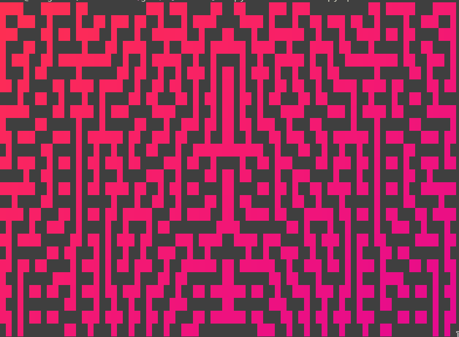
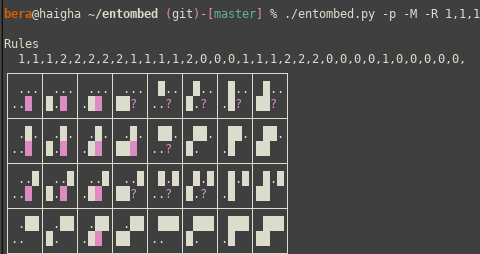

# Entombed 🥴

Who wants to do a Rorschach test? :smile:

Maze generator based on the "misterious" Entombed algorithm.


## What is it?
This program generates different mazes based on the cellular
automaton found in Entombed Atari 2600 Game.

It could be used to explore different cellular automata generation for
the mazes.

## How can I use it?

To generate a maze simply execute the script


The script has many configurations, such as disabling of symmetrical
generation with `-S`


To get a list of configurations use the switch `-h` or `--help`

You can reconfigure the cellular automaton rules using the parameter
`-R`.  You can refer to the help to get the usage of this parameter.
For example
```bash
$ ./entombed.py -R 1,1,1,2,2,2,2,2,1,1,1,1,2,0,0,0,1,1,1,2,2,2,0,0,0,0,1,0,0,0,0 -p
```
Generate the following rules



And mazes similar to this one


## Generate avatars
The script can generate custom avatars, simply use the `--output` flag
choose colors and size, similarly to the following example:

```bash
$ ./entombed.py -c 5 -r 10 -t -F 0xfff00c --output-scale 30 --output /tmp/lol.png
```

The command will generate a 300x300 png image similar to this one:


## Thanks
This work is based on the work
"Entombed: An archaeological examination of an Atari 2600 game" by
John Aycock and Tara Copplestone published in 
The Art, Science, and Engineering of Programming, 2019, Vol. 3, Issue 2, Article 4

You can find the work at [arxiv](https://arxiv.org/pdf/1811.02035v1)
